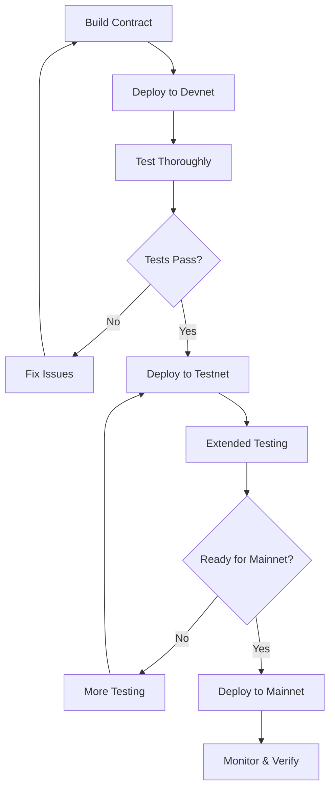

# Deployment Guide

Complete guide for deploying the Sui Move Escrow Contract to any network.

## Table of Contents

- [Prerequisites](#prerequisites)
- [Quick Start](#quick-start)
- [Deployment Workflow](#deployment-workflow)
- [Network Deployment Guides](#network-deployment-guides)
- [Upgrade Procedure](#upgrade-procedure)
- [Security Considerations](#security-considerations)
- [Troubleshooting](#troubleshooting)

## Prerequisites

### Required Software

1. **Sui CLI** (version 1.56.2+)
   ```bash
   # Install Sui CLI
   cargo install --locked --git https://github.com/MystenLabs/sui.git --branch mainnet sui
   
   # Verify installation
   sui --version
   ```

2. **jq** (JSON processor)
   ```bash
   # Ubuntu/Debian
   sudo apt-get install jq
   
   # macOS
   brew install jq
   ```

3. **Node.js** (optional, for TypeScript scripts)
   ```bash
   # Recommended: Node.js v18+
   node --version
   ```

### Sui Client Setup

1. **Initialize Sui client:**
   ```bash
   sui client
   ```

2. **Configure networks:**
   ```bash
   # Devnet (default)
   sui client new-env --alias devnet --rpc https://fullnode.devnet.sui.io:443
   
   # Testnet
   sui client new-env --alias testnet --rpc https://fullnode.testnet.sui.io:443
   
   # Mainnet
   sui client new-env --alias mainnet --rpc https://fullnode.mainnet.sui.io:443
   ```

3. **Create or import wallet:**
   ```bash
   # Create new address
   sui client new-address ed25519
   
   # Or import existing
   sui keytool import "your-private-key" ed25519
   ```

4. **Set active address:**
   ```bash
   sui client active-address
   sui client switch --address <your-address>
   ```

## Quick Start

### 1. Get Test Tokens (Devnet/Testnet)

```bash
# Request tokens for active address
./scripts/request-tokens.sh devnet

# Check balance
sui client gas
```

### 2. Deploy Contract

```bash
# Deploy to devnet
./scripts/deploy.sh devnet

# The script will output:
# - Package ID
# - Upgrade Cap ID
# - Explorer links
# - Gas used
```

### 3. Verify Deployment

```bash
# Verify the deployment
./scripts/verify.sh devnet

# Check deployment status
./scripts/status.sh
```

## Deployment Workflow

### Standard Deployment Process



### Step-by-Step Process

1. **Build and Test Locally**
   ```bash
   sui move build
   sui move test
   ```

2. **Deploy to Devnet**
   ```bash
   ./scripts/request-tokens.sh devnet
   ./scripts/deploy.sh devnet
   ./scripts/verify.sh devnet
   ```

3. **Test on Devnet**
   - Create test escrows
   - Test all functions
   - Monitor events
   - Check gas costs

4. **Deploy to Testnet** (if available)
   ```bash
   ./scripts/request-tokens.sh testnet
   ./scripts/deploy.sh testnet
   ./scripts/verify.sh testnet
   ```

5. **Deploy to Mainnet**
   ```bash
   # Ensure you have real SUI for gas
   ./scripts/deploy.sh mainnet 200000000
   ./scripts/verify.sh mainnet
   ```

## Network Deployment Guides

### Devnet Deployment

**Purpose:** Development and initial testing

**Steps:**
```bash
# 1. Get test tokens
./scripts/request-tokens.sh devnet

# 2. Deploy
./scripts/deploy.sh devnet

# 3. Save package ID
DEVNET_PKG=$(jq -r '.packageId' deployments/devnet/latest.json)
echo "Devnet Package: $DEVNET_PKG"

# 4. Test interaction
sui client call \
  --package $DEVNET_PKG \
  --module escrow \
  --function create_and_share \
  --args <your-args> \
  --gas-budget 10000000
```

**Characteristics:**
- Frequently resets
- Free test tokens
- Fast iteration
- Latest Sui features

### Testnet Deployment

**Purpose:** Pre-production testing

**Steps:**
```bash
# Similar to devnet
./scripts/request-tokens.sh testnet
./scripts/deploy.sh testnet
./scripts/verify.sh testnet
```

**Characteristics:**
- More stable than devnet
- Closer to mainnet behavior
- Good for integration testing
- Public testnet

### Mainnet Deployment

**Purpose:** Production deployment

**Prerequisites:**
- Thoroughly tested on devnet/testnet
- Security audit (recommended)
- Real SUI for gas fees
- Backup of upgrade cap

**Steps:**
```bash
# 1. Verify you have sufficient SUI
sui client gas

# 2. Review deployment one last time
sui move build
sui move test

# 3. Deploy with higher gas budget
./scripts/deploy.sh mainnet 200000000

# 4. Verify immediately
./scripts/verify.sh mainnet

# 5. Save upgrade cap securely
UPGRADE_CAP=$(jq -r '.upgradeCapId' deployments/mainnet/latest.json)
echo "CRITICAL: Store this upgrade cap ID securely: $UPGRADE_CAP"
```

**Post-Deployment:**
- Document package ID
- Secure upgrade cap (consider multisig)
- Update frontend/client
- Announce to users
- Monitor transactions

### Localnet Deployment

**Purpose:** Local development

**Setup:**
```bash
# Start local Sui network
sui-test-validator

# In another terminal
sui client new-env --alias localnet --rpc http://127.0.0.1:9000
sui client switch --env localnet

# Deploy
./scripts/deploy.sh localnet
```

## Upgrade Procedure

### When to Upgrade

- Security fixes
- Bug fixes
- New features
- Performance improvements

### Compatibility Check

Before upgrading, verify:

✅ **Allowed Changes:**
- Modify function implementations
- Add new public functions
- Add new structs
- Add new events
- Change internal logic

❌ **Not Allowed:**
- Change struct layouts
- Remove public functions
- Change function signatures
- Change struct abilities

### Upgrade Steps

1. **Make Changes**
   ```bash
   # Edit source code
   # Test thoroughly
   sui move build
   sui move test
   ```

2. **Deploy Upgrade to Devnet First**
   ```bash
   ./scripts/upgrade.sh devnet
   ```

3. **Test Upgrade**
   - Verify new functionality
   - Ensure backward compatibility
   - Test with existing objects

4. **Upgrade Production**
   ```bash
   # When ready
   ./scripts/upgrade.sh mainnet
   ```

5. **Update Clients**
   ```bash
   # Get new package ID
   NEW_PKG=$(jq -r '.packageId' deployments/mainnet/latest.json)
   
   # Update your application
   export ESCROW_PACKAGE_ID=$NEW_PKG
   ```

## Security Considerations

### Before Deployment

- [ ] All tests passing
- [ ] Code reviewed
- [ ] Security audit (for mainnet)
- [ ] Gas costs optimized
- [ ] Error handling complete
- [ ] Events properly emitted

### Upgrade Cap Security

**Critical:** The upgrade cap controls all future upgrades!

**Best Practices:**

1. **Devnet/Testnet:**
   - Keep upgrade cap in deployer wallet
   - Document the ID

2. **Mainnet:**
   - **Option 1:** Multisig wallet
     ```bash
     # Transfer to multisig
     sui client transfer \
       --to <multisig-address> \
       --object-id <upgrade-cap-id> \
       --gas-budget 10000000
     ```
   
   - **Option 2:** Secure hardware wallet
   
   - **Option 3:** Time-locked contract

3. **Backup:**
   ```bash
   # Save upgrade cap info securely
   echo "Network: mainnet" >> upgrade-cap-backup.txt
   echo "Upgrade Cap: $UPGRADE_CAP_ID" >> upgrade-cap-backup.txt
   echo "Date: $(date)" >> upgrade-cap-backup.txt
   
   # Store in secure location (password manager, vault, etc.)
   ```

### Monitoring

After deployment:

```bash
# Monitor your package
watch -n 10 'sui client object <package-id> --json | jq'

# Check events
sui client events --package <package-id>
```

## Troubleshooting

### Common Issues

#### 1. Insufficient Gas

**Error:** `Insufficient gas`

**Solution:**
```bash
# Check balance
sui client gas

# Request more (testnet/devnet)
./scripts/request-tokens.sh devnet

# Or increase gas budget
./scripts/deploy.sh devnet 200000000
```

#### 2. Network Connection

**Error:** `Failed to connect to network`

**Solution:**
```bash
# Check network configuration
sui client envs

# Test connection
curl https://fullnode.devnet.sui.io:443

# Switch network
sui client switch --env devnet
```

#### 3. Build Failures

**Error:** `Compilation failed`

**Solution:**
```bash
# Clean build
rm -rf build/

# Rebuild
sui move build

# Check for syntax errors
# Review error messages carefully
```

#### 4. Package Not Found

**Error:** `Package not found after deployment`

**Solution:**
```bash
# Wait a few seconds for processing
sleep 5

# Verify on explorer
# Check if transaction succeeded
sui client tx <digest>
```

#### 5. Upgrade Cap Missing

**Error:** `Upgrade cap not found`

**Solution:**
```bash
# Check who owns it
sui client object <upgrade-cap-id>

# Verify you're using correct address
sui client active-address

# Load from deployment file
jq -r '.upgradeCapId' deployments/<network>/latest.json
```

## Advanced Topics

### CI/CD Integration

See `scripts/README.md` for GitHub Actions examples.

### Programmatic Deployment

Use TypeScript scripts for automated deployments:

```bash
cd scripts
npm install
npx tsx deploy.ts devnet
```

### Multi-Network Management

Manage deployments across networks:

```bash
# Deploy to all networks
for network in devnet testnet mainnet; do
  ./scripts/deploy.sh $network
done

# Check status
./scripts/status.sh
```

### Monitoring & Analytics

Set up monitoring for your deployed contract:

1. Watch package events
2. Monitor gas usage
3. Track function calls
4. Alert on errors

## Best Practices Summary

1. ✅ Always test on devnet first
2. ✅ Use testnet for pre-production
3. ✅ Audit code before mainnet
4. ✅ Secure upgrade caps properly
5. ✅ Document all deployments
6. ✅ Monitor after deployment
7. ✅ Test upgrades thoroughly
8. ✅ Keep deployment history
9. ✅ Use version control
10. ✅ Have rollback plan

## Resources

- [Sui Documentation](https://docs.sui.io/)
- [Move Language Book](https://move-language.github.io/move/)
- [Sui Discord](https://discord.gg/sui)
- [Sui GitHub](https://github.com/MystenLabs/sui)
- [Sui Explorer](https://explorer.sui.io/)

## Support

For issues with these scripts:
1. Check `scripts/README.md`
2. Review error messages
3. Consult Sui documentation
4. Ask in Sui Discord

---

**Last Updated:** 2024
**Contract Version:** 1.0.0

